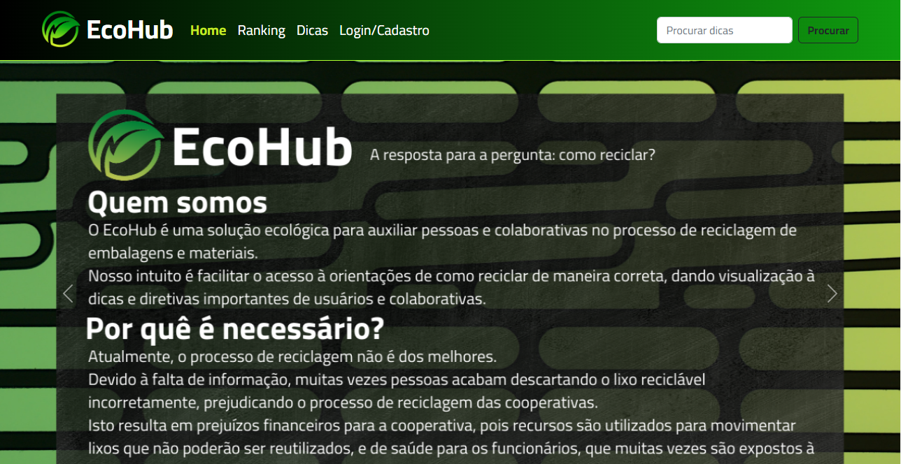
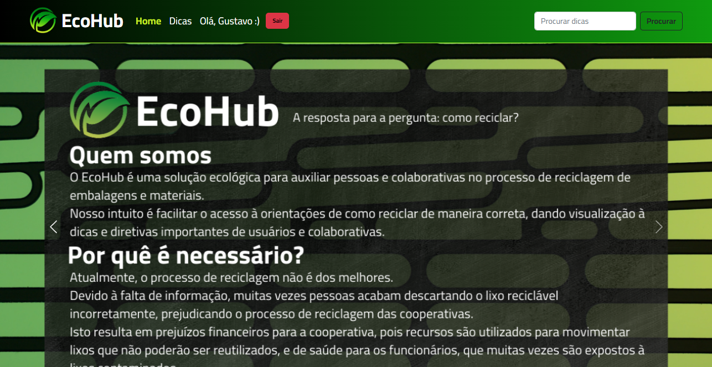
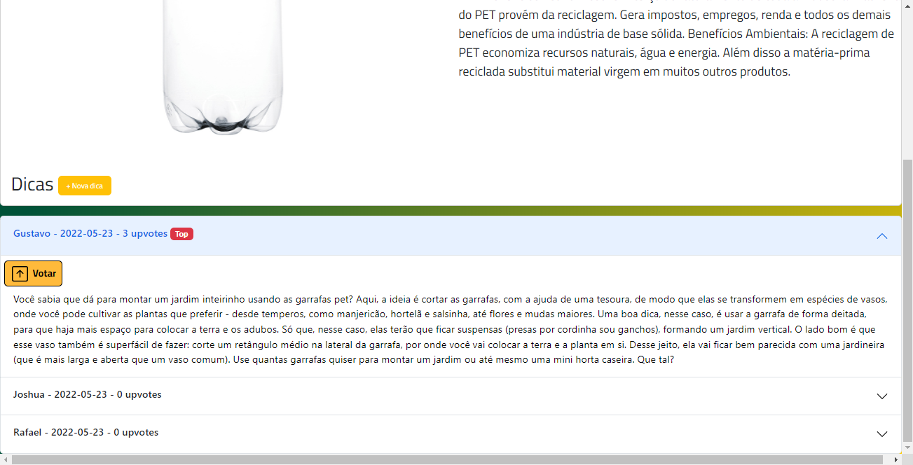
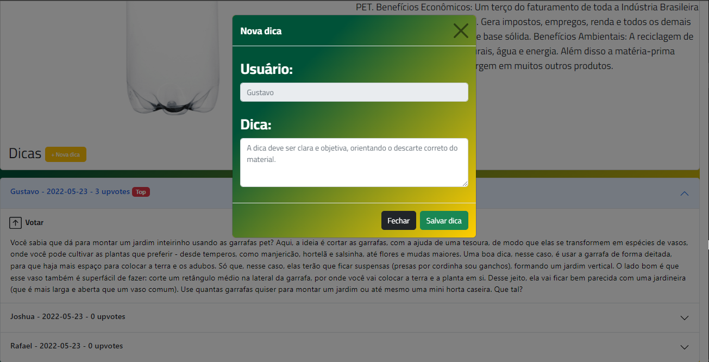

# EcoHub - ReciclaHack Project
EcoHub é o projeto oferecido como solução para o ReciclaHack Hackathon feito pela Hackathon Brasil.
É um polo de informação e comunicação para reciclagem, proporcionando informações de fácil acesso e comunicação entre 
usuários e centros de reciclagem. Link para a página de informações do Hackathon: https://www.abre.org.br/reciclahack/.

### Como funciona?

Dentro da Home Page você tem acesso as Dicas, poderá se cadastrar ou efetuar o login:

#### Login:
Clique em "Login/Cadastro" crie sua conta ou clique em "Ja possuo uma conta" para logar.

Após criar sua conta e logar você sera redirecionado para a Home Page, agora autenticado com o seu usuário, você terá acesso a todas as funcionalidades do sistema.

#### Visualizar e criar dicas:

Em "Dicas" você tera acesso as categorias de lixo reciclavel, você pode escolher uma categoria e assim encontrar os materias cadastrados daquela respectiva categoria.

Ao clicar em "Ver dicas" de algum material, você verá a descrição do material...

Ao descer você verá as dicas inseridas por usuários do sistema, se logado você poderá votar nas melhores dicas e inserir suas próprias dicas.

Para votar em um comentário basta clicar em "Votar":

Para enviar uma dica, clique em "+ Nova dica" e preencha os campos:

### Instalar dependências:

Para instalar as dependencias crie uma Pipenv:

#### obs: E necessario ter "pipenv" instalado no seu python para seguir. 

---

Após a instalação execute o comando:

`pipenv install`

## Inicializar projeto:

Execute o arquivo app/main.py

### Banco de dados:

#### Para atualizar banco de dados depois de alterações nos modelos:
Rode os seguintes comandos:

1º `flask db migrate`

2º `flask db upgrade`
